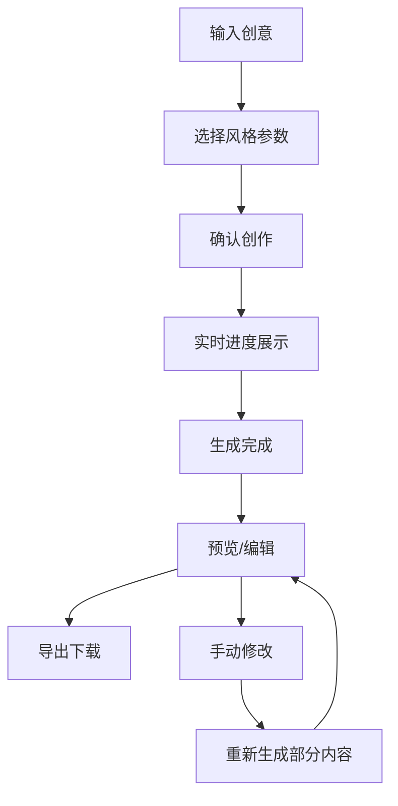

# AI智能小说生成器 产品需求文档 (PRD)
**Product Requirements Document for AI Super Novel Generator**

---

## 文档信息
- **产品名称**: AI智能小说生成器 (AI Super Novel Generator)
- **版本**: v1.0
- **创建日期**: 2025-05-29
- **最后更新**: 2025-05-29
- **文档状态**: 草案
- **产品经理**: [待填写]
- **技术负责人**: [待填写]

---

## 1. 产品概述

### 1.1 产品愿景
基于大语言模型技术，打造一个能够模拟高级作家创作思维的智能小说生成引擎，实现"一句话输入，生成超大规模长篇小说"的革命性创作体验，支持生成500万字以上的超长篇作品。

### 1.2 产品定位
面向创意写作领域的AI辅助工具，通过解析和抽象化专业作家的创作流程，为用户提供高质量、结构完整的超大规模长篇小说创作服务。

### 1.3 核心价值主张
- **专业创作引擎**: 基于高级作家工作模式的规则化创作系统
- **一键生成**: 仅需一句话灵感，自动完成任意字数长篇小说（支持500万字+）
- **智能策略选择**: 根据目标字数自动选择最优生成策略和架构设计
- **超大规模管理**: 独创的分层级管理系统，确保超长篇作品的逻辑一致性
- **结构化创作**: 遵循经典叙事结构，确保故事逻辑性和完整性
- **个性化定制**: 支持多种文学风格和题材类型

---

## 2. 目标用户与市场分析

### 2.1 目标用户群体

#### 主要用户
1. **业余写作爱好者**
   - 有创作想法但缺乏写作技巧
   - 希望快速将创意转化为完整作品

2. **内容创作者**
   - 自媒体运营者、网络小说作者
   - 需要大量内容产出，寻求效率提升

3. **出版行业从业者**
   - 编辑、策划人员
   - 需要快速评估故事概念的可行性

#### 次要用户
1. **教育工作者**
   - 创意写作教师
   - 用于教学演示和学生练习

2. **娱乐行业**
   - 游戏策划、编剧
   - 需要故事原型和创意灵感

### 2.2 市场分析
- **市场规模**: 全球数字出版市场预计2025年达到XX亿美元
- **竞争态势**: 现有AI写作工具多数局限于短文本生成
- **市场机会**: 长篇小说生成领域尚无成熟产品

---

## 3. 核心功能设计

### 3.1 功能架构图

```
用户输入（一句话创意）
         ↓
    输入处理模块
         ↓
    概念扩展引擎
         ↓
    故事大纲生成器
         ↓
    角色与世界观构建器
         ↓
    分章节文本生成器
         ↓
    智能修订系统
         ↓
    一致性检查器
         ↓
    格式化输出模块
         ↓
完整小说文件（EPUB/PDF/DOC）
```

### 3.2 核心功能模块

#### 3.2.1 智能概念扩展模块
**功能描述**: 将用户输入的一句话创意扩展为详细的故事概念

**核心能力**:
- 自动识别关键元素（主角、目标、冲突、主题）
- 生成核心主题和情感基调
- 确定故事类型和风格方向

**输入示例**: "一个孤儿发现自己是魔法世界的救世主"
**输出示例**: 
```json
{
  "theme": "自我认同与责任",
  "core_conflict": "主角必须对抗黑暗势力，同时面对内心的恐惧",
  "emotional_tone": "黑暗奇幻，带有希望",
  "genre": "奇幻冒险",
  "target_length": "中篇小说(5-8万字)"
}
```

#### 3.2.2 智能规模化大纲生成器
**功能描述**: 基于目标字数和故事概念生成多层级、可扩展的详细大纲系统

**核心能力**:
- **智能字数规划**: 根据目标字数（10万-500万+）自动选择结构复杂度
- **分层级架构**: 支持卷-部-章-节的四级结构体系
- **动态扩展**: 可在创作过程中智能扩展storyline和支线情节
- **节奏智能控制**: 基于字数目标优化情节密度和转折频率

**字数策略映射**:
```json
{
  "scale_strategies": {
    "10-30万字": {
      "structure": "经典三幕剧",
      "chapters": "15-30章",
      "subplots": "2-3条",
      "character_depth": "核心角色深度刻画"
    },
    "30-100万字": {
      "structure": "多卷本结构",
      "volumes": "3-5卷",
      "chapters_per_volume": "15-25章",
      "subplots": "5-8条",
      "character_depth": "主要+次要角色全面发展"
    },
    "100-500万字": {
      "structure": "史诗级多部曲",
      "parts": "5-10部",
      "volumes_per_part": "2-4卷",
      "subplots": "10-20条主要支线",
      "character_depth": "庞大角色群像+配角独立故事线"
    },
    "500万字+": {
      "structure": "超大型世界观体系",
      "story_arcs": "多个独立又相关的故事弧",
      "timeline_span": "可跨越数十年时间线",
      "subplots": "30+条支线形成复杂网络",
      "character_depth": "每个重要角色都有完整人生轨迹"
    }
  }
}
```

**超大规模结构示例（500万字）**:
```json
{
  "total_target_words": 5000000,
  "structure_type": "史诗级世界观体系",
  "story_arcs": [
    {
      "arc_name": "王朝兴起篇",
      "target_words": 1000000,
      "parts": 3,
      "main_theme": "权力与理想的冲突"
    },
    {
      "arc_name": "帝国扩张篇",
      "target_words": 1500000,
      "parts": 4,
      "main_theme": "征服与文明的碰撞"
    },
    {
      "arc_name": "内乱动荡篇",
      "target_words": 1500000,
      "parts": 4,
      "main_theme": "背叛与忠诚的考验"
    },
    {
      "arc_name": "终极决战篇",
      "target_words": 1000000,
      "parts": 3,
      "main_theme": "命运与选择的终极对决"
    }
  ],
  "character_network": {
    "protagonist_tier": 8,
    "deuteragonist_tier": 20,
    "supporting_tier": 100,
    "background_tier": 500
  },
  "subplot_complexity": {
    "main_storylines": 12,
    "romantic_arcs": 8,
    "political_intrigue": 15,
    "character_development": 25,
    "world_building": 10
  }
}
```

#### 3.2.3 角色与世界观构建器
**功能描述**: 创建立体的角色形象和丰富的故事世界

**角色系统**:
- 主要角色详细档案（背景、动机、弱点、成长弧线）
- 次要角色简化档案
- 角色关系网络图
- 角色发展时间线

**世界观系统**:
- 地理环境设定
- 社会制度和文化背景
- 技术/魔法体系（如适用）
- 历史背景和重要事件

#### 3.2.4 智能文本生成引擎
**功能描述**: 基于大纲分章节生成高质量文本内容

**生成策略**:
- 场景化写作：每章按"目标-冲突-结果"结构
- 内容平衡：动作40% + 对话30% + 描述30%
- 风格一致性：维持统一的叙述风格
- 钩子机制：每章结尾设置悬念

**技术特色**:
- 上下文管理：智能压缩前文信息
- 并行生成：支持多章节同时处理
- 实时检索：动态获取角色和世界观信息

#### 3.2.5 多轮智能修订系统
**功能描述**: 模拟专业作家的多轮修订流程

**修订层次**:
1. **结构修订**: 检查情节逻辑和因果关系
2. **角色修订**: 确保角色行为与设定一致
3. **语言修订**: 优化表达，提升文学性
4. **风格修订**: 统一文风，消除违和感

**反馈机制**:
- 模拟Beta读者反馈
- 自动识别常见问题
- 提供修改建议和替代方案

#### 3.2.6 一致性保障系统
**功能描述**: 确保全文在角色、世界观、情节等方面的一致性

**检查维度**:
- 角色信息一致性（年龄、外貌、性格等）
- 世界观设定一致性（规则、地理、文化等）
- 时间线逻辑一致性
- 情节因果关系一致性

**技术实现**:
- 向量数据库存储关键信息
- 实时检索和比对
- 自动标记不一致问题
- 智能修复建议

---

## 4. 技术架构设计

### 4.1 系统架构

#### 4.1.1 技术栈选择
**后端技术**:
- **核心框架**: Python + FastAPI
- **LLM集成**: LangChain
- **数据库**: PostgreSQL + Redis + FAISS
- **任务队列**: Celery
- **容器化**: Docker + Kubernetes

**前端技术**:
- **Web界面**: React + TypeScript
- **移动端**: React Native（后期规划）
- **桌面端**: Electron（可选）

**云服务与部署**:
- **云平台**: AWS/Azure/阿里云
- **GPU加速**: NVIDIA A100（如需本地部署）
- **CDN**: CloudFlare
- **监控**: Prometheus + Grafana

#### 4.1.2 大语言模型选择
**主要选项**:
1. **OpenAI GPT-4 Turbo**: 128K上下文，质量最高
2. **Anthropic Claude 3**: 200K上下文，安全性好
3. **开源方案**: Llama 3 70B（本地部署）

**混合策略**:
- 核心创作：GPT-4 Turbo
- 辅助功能：GPT-3.5 Turbo
- 成本优化：根据任务复杂度动态选择

### 4.2 数据架构

#### 4.2.1 核心数据结构
```sql
-- 项目表
CREATE TABLE projects (
    id UUID PRIMARY KEY,
    user_id UUID NOT NULL,
    title VARCHAR(200),
    original_prompt TEXT,
    concept JSONB,
    outline JSONB,
    characters JSONB,
    world_setting JSONB,
    style_config JSONB,
    created_at TIMESTAMP,
    updated_at TIMESTAMP,
    status VARCHAR(50)
);

-- 章节表
CREATE TABLE chapters (
    id UUID PRIMARY KEY,
    project_id UUID REFERENCES projects(id),
    chapter_number INTEGER,
    title VARCHAR(200),
    outline TEXT,
    content TEXT,
    word_count INTEGER,
    revision_count INTEGER,
    status VARCHAR(50),
    created_at TIMESTAMP,
    updated_at TIMESTAMP
);

-- 修订历史表
CREATE TABLE revisions (
    id UUID PRIMARY KEY,
    chapter_id UUID REFERENCES chapters(id),
    revision_number INTEGER,
    content TEXT,
    revision_type VARCHAR(50),
    changes_summary TEXT,
    created_at TIMESTAMP
);
```

#### 4.2.2 向量数据库设计
**用途**: 存储和检索角色、世界观、情节要素的语义信息
**技术方案**: FAISS + Sentence-BERT
**数据类型**:
- 角色描述向量
- 世界观设定向量
- 情节事件向量
- 对话风格向量

### 4.3 超大规模核心算法设计

#### 4.3.1 超大规模创作引擎
```python
def 超级创作引擎(用户输入, 目标字数=5000000, 风格=None):
    # 步骤1: 概念扩展与规模评估
    故事概念 = 大模型调用(规则1.1, 输入=用户输入)
    规模策略 = 选择规模策略(目标字数)
    
    # 步骤2: 分层级大纲生成
    if 目标字数 >= 1000000:  # 100万字以上使用分层策略
        史诗大纲 = 生成史诗级大纲(故事概念, 目标字数)
        故事弧列表 = 分解故事弧(史诗大纲)
    else:
        大纲 = 生成标准大纲(故事概念, 目标字数)
        故事弧列表 = [大纲]
    
    # 步骤3: 角色与世界构建（分级管理）
    if 目标字数 >= 500000:  # 50万字以上需要角色分级系统
        角色系统 = 构建分级角色系统(史诗大纲, 目标字数)
        世界观系统 = 构建完整世界观(史诗大纲, 目标字数)
    else:
        角色档案 = 大模型调用(规则3.1, 输入=大纲)
        世界设定 = 大模型调用(规则3.2, 输入=大纲)
    
    # 步骤4: 分阶段文本生成
    完整小说 = []
    全局记忆库 = 初始化记忆库(角色系统, 世界观系统)
    
    for 故事弧 in 故事弧列表:
        弧文本 = []
        for 部 in 故事弧['部分']:
            部文本 = []
            for 卷 in 部['卷']:
                卷文本 = []
                for 章 in 卷['章节']:
                    # 动态上下文管理
                    上下文 = 智能上下文管理器.获取相关上下文(
                        章节信息=章,
                        全局记忆=全局记忆库,
                        最大token=规模策略['上下文限制']
                    )
                    
                    # 生成章节
                    章节文本 = 大模型调用(
                        规则4.1,
                        输入=章['摘要'],
                        上下文=上下文,
                        风格=风格,
                        目标字数=章['目标字数']
                    )
                    
                    # 更新全局记忆
                    全局记忆库.更新(章节文本, 章节信息=章)
                    卷文本.append(章节文本)
                
                # 卷级别修订
                修订后卷文本 = 卷级修订器(卷文本, 全局记忆库)
                部文本.extend(修订后卷文本)
            
            # 部级别一致性检查
            一致性检查器.检查并修复(部文本, 全局记忆库)
            弧文本.extend(部文本)
        
        # 故事弧级别整合
        弧整合器.整合并优化(弧文本, 全局记忆库)
        完整小说.extend(弧文本)
    
    # 步骤5: 全局修订与优化
    if 目标字数 >= 1000000:  # 超大规模需要专门的全局修订
        完整小说 = 全局修订器.多轮修订(
            完整小说,
            全局记忆库,
            修订策略=规模策略['修订策略']
        )
    
    # 步骤6: 最终检查与输出
    最终小说 = 最终优化器.处理(完整小说, 目标字数)
    return 最终小说
```

#### 4.3.2 智能上下文管理算法
```python
class 智能上下文管理器:
    def __init__(self, 最大记忆容量=1000000):
        self.记忆容量 = 最大记忆容量
        self.重要性评分器 = 重要性评分模型()
        
    def 获取相关上下文(self, 章节信息, 全局记忆, 最大token):
        # 1. 检索最相关的历史内容
        相关内容 = self.向量检索(章节信息, 全局记忆)
        
        # 2. 获取核心角色当前状态
        角色状态 = self.获取角色当前状态(章节信息['涉及角色'])
        
        # 3. 获取世界观当前状态
        世界状态 = self.获取世界当前状态(章节信息['场景设定'])
        
        # 4. 智能压缩以适应token限制
        压缩上下文 = self.智能压缩(相关内容, 角色状态, 世界状态, 最大token)
        
        return 压缩上下文
    
    def 智能压缩(self, 相关内容, 角色状态, 世界状态, 最大token):
        """智能压缩超大规模上下文信息"""
        # 1. 优先级排序
        重要性分数 = self.重要性评分器.评分([相关内容, 角色状态, 世界状态])
        
        # 2. 动态分配token
        if 最大token > 100000:  # 超大规模需要更多上下文
            token分配 = {
                '角色状态': int(最大token * 0.3),
                '世界状态': int(最大token * 0.2),
                '相关内容': int(最大token * 0.5)
            }
        else:
            token分配 = {
                '角色状态': int(最大token * 0.4),
                '世界状态': int(最大token * 0.3),
                '相关内容': int(最大token * 0.3)
            }
        
        # 3. 分别压缩各部分
        压缩后内容 = {}
        for 内容类型, 分配token in token分配.items():
            if 内容类型 == '角色状态':
                压缩后内容[内容类型] = self.压缩角色信息(角色状态, 分配token)
            elif 内容类型 == '世界状态':
                压缩后内容[内容类型] = self.压缩世界信息(世界状态, 分配token)
            else:
                压缩后内容[内容类型] = self.压缩历史内容(相关内容, 分配token)
        
        return 压缩后内容

class 超大规模一致性检查器:
    def __init__(self, vector_db):
        self.vector_db = vector_db
        self.similarity_threshold = 0.85
        self.超大规模阈值 = 1000000  # 100万字以上启用深度检查
        
    def 检查并修复(self, 文本内容, 全局记忆库):
        """超大规模作品的一致性检查和修复"""
        if len(''.join(文本内容)) > self.超大规模阈值:
            return self.深度一致性检查(文本内容, 全局记忆库)
        else:
            return self.标准一致性检查(文本内容, 全局记忆库)
    
    def 深度一致性检查(self, 文本内容, 全局记忆库):
        """针对超大规模作品的深度一致性检查"""
        不一致问题 = []
        
        # 1. 角色一致性检查（多线程并行）
        角色问题 = self.并行角色检查(文本内容, 全局记忆库)
        不一致问题.extend(角色问题)
        
        # 2. 时间线一致性检查
        时间线问题 = self.检查时间线逻辑(文本内容, 全局记忆库)
        不一致问题.extend(时间线问题)
        
        # 3. 世界观规则一致性检查
        世界观问题 = self.检查世界观规则(文本内容, 全局记忆库)
        不一致问题.extend(世界观问题)
        
        # 4. 自动修复机制
        if 不一致问题:
            修复后文本 = self.自动修复不一致(文本内容, 不一致问题, 全局记忆库)
            return 修复后文本
        
        return 文本内容
```

---

## 5. 用户体验设计

### 5.1 用户界面设计

#### 5.1.1 主要页面结构
1. **创作启动页**
   - 简洁的输入框
   - 风格选择器
   - 长度设置
   - 高级选项折叠面板

2. **创作进度页**
   - 实时进度条
   - 当前处理阶段显示
   - 预览窗口
   - 暂停/继续控制

3. **作品管理页**
   - 项目列表
   - 状态筛选
   - 搜索功能
   - 批量操作

4. **编辑器页面**
   - 章节导航
   - 实时编辑
   - 修订历史
   - 导出选项

#### 5.1.2 交互流程设计


### 5.2 个性化设置

#### 5.2.1 风格配置选项
- **经典文学风格**: 托尔金、海明威、村上春树等
- **类型小说风格**: 科幻、奇幻、悬疑、言情等
- **叙述视角**: 第一人称、第三人称有限、第三人称全知
- **语言风格**: 简洁、华丽、诗意、口语化

#### 5.2.2 结构模板
- **三幕剧结构**: 经典好莱坞模式
- **英雄之旅**: 坎贝尔神话模式
- **悬疑结构**: 推理小说模式
- **成长小说**: bildungsroman结构

#### 5.2.3 智能长度控制系统
- **短篇小说**: 1-3万字（单一故事线，简单结构）
- **中篇小说**: 3-10万字（双线并行，经典三幕）
- **长篇小说**: 10-50万字（多卷本，复杂支线）
- **超长篇小说**: 50-200万字（史诗级世界观）
- **巨型小说**: 200-500万字（多代人物，时代变迁）
- **超级史诗**: 500万字以上（完整文明史，庞大角色群像）

**智能字数分配算法**:
```json
{
  "word_distribution_strategy": {
    "500万字目标": {
      "worldbuilding_ratio": "5%", // 25万字用于世界观构建
      "character_development": "15%", // 75万字用于角色发展
      "main_plot": "60%", // 300万字主线剧情
      "subplots": "15%", // 75万字支线情节
      "transitions_descriptions": "5%" // 25万字场景转换和描述
    },
    "chapter_length_strategy": {
      "early_chapters": "3000-5000字", // 建立节奏
      "middle_chapters": "5000-8000字", // 充分展开
      "climax_chapters": "8000-12000字", // 高潮详述
      "finale_chapters": "4000-6000字" // 收尾整理
    }
  }
}
```

---

## 6. 质量保障体系

### 6.1 内容质量标准

#### 6.1.1 结构完整性
- **开端**: 世界观建立、角色介绍清晰
- **发展**: 冲突递进有序、张力控制适当
- **高潮**: 转折点设置合理、情感冲击强烈
- **结尾**: 冲突解决完整、主题升华明确

#### 6.1.2 角色塑造
- **立体性**: 角色有明确的动机、弱点、成长轨迹
- **一致性**: 行为符合性格设定、发展符合逻辑
- **多样性**: 避免脸谱化、增加角色层次

#### 6.1.3 语言表达
- **流畅性**: 句式变化丰富、节奏感良好
- **准确性**: 用词精确、语法正确
- **风格性**: 保持统一文风、符合类型特征

### 6.2 自动化质量检测

#### 6.2.1 技术指标
- **文本相似度检测**: 避免重复内容
- **语法检查**: 自动修正语法错误
- **逻辑一致性**: 检测情节矛盾
- **角色追踪**: 监控角色信息变化

#### 6.2.2 评估模型
```python
class QualityAssessment:
    def __init__(self):
        self.metrics = {
            'coherence': CoherenceModel(),
            'engagement': EngagementModel(),
            'originality': OriginalityModel(),
            'technical': TechnicalModel()
        }
    
    def evaluate_chapter(self, chapter_text, context):
        scores = {}
        for metric_name, model in self.metrics.items():
            scores[metric_name] = model.score(chapter_text, context)
        
        return QualityScore(scores)
```

### 6.3 人工审核机制

#### 6.3.1 审核流程
1. **自动初筛**: AI质量检测
2. **专家评估**: 文学专家人工review
3. **用户反馈**: 收集使用者评价
4. **迭代优化**: 基于反馈调整算法

#### 6.3.2 质量分级
- **S级**: 出版质量，可直接商用
- **A级**: 优秀质量，略需润色
- **B级**: 良好质量，需要修改
- **C级**: 基础质量，需大幅改进

---

## 7. 商业模式

### 7.1 产品定价策略

#### 7.1.1 免费体验版
- **功能**: 短篇小说生成（1万字以内）
- **限制**: 每月3次免费生成
- **目的**: 用户获取和体验

#### 7.1.2 标准版 (¥99/月)
- **功能**: 中篇小说生成（8万字以内）
- **额度**: 每月10部作品
- **特色**: 基础风格选择、标准修订

#### 7.1.3 专业版 (¥299/月)
- **功能**: 长篇小说生成（无字数限制）
- **额度**: 每月20部作品
- **特色**: 高级风格定制、深度修订、优先处理

#### 7.1.4 企业版 (¥999/月)
- **功能**: 批量生成、API接入
- **额度**: 无限制
- **特色**: 私有部署、定制化开发、专属支持

### 7.2 收入模式

#### 7.2.1 订阅收入 (70%)
- 个人用户月/年度订阅
- 企业客户定制化服务
- 教育机构批量授权

#### 7.2.2 内容服务收入 (20%)
- 付费精修服务
- 专业编辑人工润色
- 出版咨询服务

#### 7.2.3 平台分成收入 (10%)
- 优秀作品版权代理
- 影视IP孵化合作
- 有声书制作分成

### 7.3 市场推广策略

#### 7.3.1 目标市场
- **一级市场**: 中国大陆地区
- **二级市场**: 港澳台、东南亚华语区
- **三级市场**: 北美、欧洲华人群体

#### 7.3.2 推广渠道
- **内容营销**: 技术博客、创作分享
- **社群运营**: 写作爱好者社区
- **合作推广**: 写作平台、出版社合作
- **KOL营销**: 知名作者、编辑推荐

---

## 8. 风险评估与应对

### 8.1 技术风险

#### 8.1.1 AI模型依赖风险
**风险描述**: 依赖第三方API服务，存在服务中断、价格上涨风险
**应对措施**:
- 多模型备选方案
- 本地化部署能力
- 成本预算与控制机制

#### 8.1.2 质量稳定性风险
**风险描述**: AI生成内容质量不稳定，影响用户体验
**应对措施**:
- 完善的质量检测体系
- 人工审核备用机制
- 用户反馈快速响应

#### 8.1.3 技术迭代风险
**风险描述**: AI技术快速发展，产品技术栈可能过时
**应对措施**:
- 模块化架构设计
- 持续技术调研
- 快速迭代能力

### 8.2 法律合规风险

#### 8.2.1 版权争议风险
**风险描述**: AI生成内容可能涉及版权问题
**应对措施**:
- 版权声明与免责条款
- 原创性检测机制
- 法律顾问支持

#### 8.2.2 内容监管风险
**风险描述**: 生成内容可能违反当地法规
**应对措施**:
- 内容审核过滤系统
- 敏感词库维护
- 地区化合规策略

#### 8.2.3 数据隐私风险
**风险描述**: 用户创作内容涉及隐私保护
**应对措施**:
- 数据加密存储
- 隐私政策透明化
- 符合GDPR/CCPA要求

### 8.3 商业风险

#### 8.3.1 市场竞争风险
**风险描述**: 大厂入局，竞争加剧
**应对措施**:
- 技术壁垒建设
- 用户粘性提升
- 差异化定位

#### 8.3.2 用户接受度风险
**风险描述**: 用户对AI创作接受度有限
**应对措施**:
- 循序渐进的产品教育
- 质量标杆建设
- 社区口碑营造

---

## 9. 开发计划

### 9.1 项目里程碑

#### 9.1.1 概念验证版本 (2个月)
**目标**: 验证超大规模生成的技术可行性
**功能范围**:
- 基础概念扩展
- 智能字数策略选择
- 10万字规模测试
- 分层级大纲原型

**交付物**:
- 技术可行性报告
- 10万字样本小说
- 核心算法验证

#### 9.1.2 MVP版本 (4个月)
**目标**: 实现50万字规模生成能力
**功能范围**:
- 完整分层级大纲系统
- 智能上下文管理
- 50万字生成测试
- 基础一致性检查

**交付物**:
- 50万字规模原型
- 性能基准测试
- 用户界面原型

#### 9.1.3 Alpha版本 (7个月)
**目标**: 突破100万字生成能力
**功能范围**:
- 史诗级架构系统
- 全局记忆管理
- 100万字稳定生成
- 多轮修订系统

**交付物**:
- 100万字内测版本
- 大规模性能优化
- 质量评估体系

#### 9.1.4 Beta版本 (10个月)
**目标**: 实现500万字超大规模生成
**功能范围**:
- 超级史诗架构
- 智能资源调度
- 500万字生成能力
- 用户定制化接口

**交付物**:
- 500万字公测版本
- 超大规模案例库
- 用户反馈优化

#### 9.1.5 正式版本 (12个月)
**目标**: 商业化上线，支持任意字数
**功能范围**:
- 无限制字数生成
- 完整商业化功能
- 企业级部署
- 全球化支持

**交付物**:
- 正式发布版本
- 商业化运营体系
- 超大规模成功案例

### 9.2 团队组建

#### 9.2.1 核心团队 (8-12人)
- **产品经理** 1人: 需求分析、产品规划
- **技术负责人** 1人: 技术架构、团队管理
- **AI工程师** 2-3人: 模型调优、算法开发
- **后端工程师** 2人: 系统开发、数据库设计
- **前端工程师** 2人: Web/移动端开发
- **测试工程师** 1人: 质量保障、自动化测试
- **UI/UX设计师** 1人: 界面设计、交互优化

#### 9.2.2 顾问团队
- **文学专家**: 创作理论指导
- **出版行业专家**: 市场分析、商业模式
- **AI技术专家**: 技术发展趋势
- **法律顾问**: 合规风险控制

### 9.3 预算估算

#### 9.3.1 开发成本 (12个月)
- **人力成本**: 800万人民币
- **技术成本**: 200万人民币 (服务器、API费用)
- **运营成本**: 100万人民币
- **其他成本**: 100万人民币
- **总计**: 1200万人民币

#### 9.3.2 运营成本 (年)
- **服务器费用**: 300万人民币
- **API调用费用**: 500万人民币
- **人力成本**: 1000万人民币
- **市场推广**: 500万人民币
- **总计**: 2300万人民币

---

## 10. 成功指标

### 10.1 技术指标

#### 10.1.1 性能指标
- **生成速度**: 平均每万字生成时间 < 5分钟
- **系统可用性**: 99.9%以上
- **并发处理**: 支持1000+用户同时使用
- **API响应**: 平均响应时间 < 2秒

#### 10.1.2 质量指标
- **用户满意度**: 生成内容满意度 > 80%
- **完成率**: 完整小说生成成功率 > 95%
- **一致性**: 角色/世界观一致性检测准确率 > 90%
- **原创性**: 内容重复率 < 5%

### 10.2 商业指标

#### 10.2.1 用户指标
- **注册用户**: 第一年达到5万+（超大规模生成用户门槛较高）
- **付费用户**: 付费转化率 > 25%（高价值用户群体）
- **用户留存**: 月活跃用户留存率 > 70%
- **用户价值**: 年均ARPU > 3000元（超大规模生成价值更高）

#### 10.2.2 收入指标
- **年收入**: 第二年达到8000万人民币
- **月收入增长**: 环比增长率 > 15%
- **毛利率**: 保持在50%以上（考虑超大规模计算成本）
- **获客成本**: CAC < 1200元

### 10.3 产品指标

#### 10.3.1 超大规模内容指标
- **生成总量**: 年生成小说数量5万部+
- **字数统计**: 累计生成文字100亿字+（单部作品平均200万字）
- **超大规模占比**: 100万字以上作品占比 > 60%
- **超级史诗作品**: 500万字以上作品月产量 > 1000部
- **类型覆盖**: 支持30+种文学类型和子类型
- **质量分布**: A级以上内容占比 > 80%

#### 10.3.2 超大规模技术指标
- **生成速度**: 500万字作品完整生成时间 < 6小时
- **一致性保持**: 超大规模作品角色/世界观一致性 > 95%
- **内存管理**: 支持同时处理10个500万字项目
- **故障恢复**: 超长生成过程中断恢复成功率 > 99%
- **分布式处理**: 支持跨节点协同生成超大规模内容

#### 10.3.3 功能指标
- **核心功能使用**: 超大规模生成功能使用率 > 90%
- **修订效率**: 500万字作品平均修订次数 < 2次
- **分阶段生成**: 阶段性保存和恢复成功率 > 99%
- **用户满意度**: 超大规模作品满意度 > 85%

---

## 11. 附录

### 11.1 技术选型对比

#### 11.1.1 大语言模型对比
| 模型 | 上下文长度 | 质量评分 | 成本(每万tokens) | 可控性 | 部署方式 |
|------|------------|----------|------------------|--------|----------|
| GPT-4 Turbo | 128K | 9.5/10 | $30 | 高 | API |
| Claude 3 Opus | 200K | 9.3/10 | $45 | 高 | API |
| Llama 3 70B | 8K | 8.5/10 | $5 | 中 | 本地 |
| GLM-4 | 128K | 8.0/10 | $10 | 中 | API/本地 |

#### 11.1.2 数据库选型对比
| 数据库 | 用途 | 优势 | 劣势 | 选择理由 |
|--------|------|------|------|----------|
| PostgreSQL | 主数据库 | ACID特性、JSON支持 | 配置复杂 | 可靠性高 |
| Redis | 缓存 | 高性能、数据结构丰富 | 内存限制 | 提升响应速度 |
| FAISS | 向量检索 | 高效相似度搜索 | 维护成本 | 一致性检查需要 |

### 11.2 竞品分析

#### 11.2.1 主要竞品
1. **Jasper AI**
   - 优势: 营销文案生成优秀
   - 劣势: 长文本能力有限
   - 差异化: 我们专注长篇小说

2. **Copy.ai**
   - 优势: 界面简洁，易用性好
   - 劣势: 创意文学功能弱
   - 差异化: 更专业的文学创作

3. **Novel AI**
   - 优势: 专注小说创作
   - 劣势: 质量不稳定
   - 差异化: 更规范的创作流程

#### 11.2.2 竞争优势
- **专业性**: 基于作家工作模式的创作引擎
- **完整性**: 端到端的长篇小说生成
- **质量**: 多轮修订确保内容质量
- **本土化**: 更适合中文创作环境

### 11.3 相关资源

#### 11.3.1 学术资源
- 《The Writer's Journey》- Christopher Vogler
- 《On Writing》- Stephen King  
- 《Into the Woods》- John Yorke
- 《The Anatomy of Story》- John Truby

#### 11.3.2 技术资源
- LangChain官方文档
- OpenAI API参考
- Anthropic Claude文档
- HuggingFace Transformers

#### 11.3.3 行业报告
- 《2024中国数字出版产业报告》
- 《AI写作工具市场分析报告》
- 《内容创作行业发展趋势》

---

## 结语

AI智能小说生成器代表了人工智能技术在创意领域的重要应用。通过深度解析专业作家的创作模式，我们能够构建一个既保持创作质量又大幅提升效率的智能创作系统。

本产品的成功将不仅为个人创作者提供强大的工具，也将为整个内容创作产业带来革命性的变化。我们相信，在技术不断进步和用户需求不断增长的推动下，AI智能小说生成器必将成为文学创作领域的重要基础设施。

未来，我们将持续优化算法模型，扩展功能边界，致力于让每个人都能轻松创作出高质量的文学作品，推动人类创意表达的民主化进程。

---

**文档版本**: v1.0  
**最后更新**: 2025-05-29  
**下次评审**: 2025-06-15