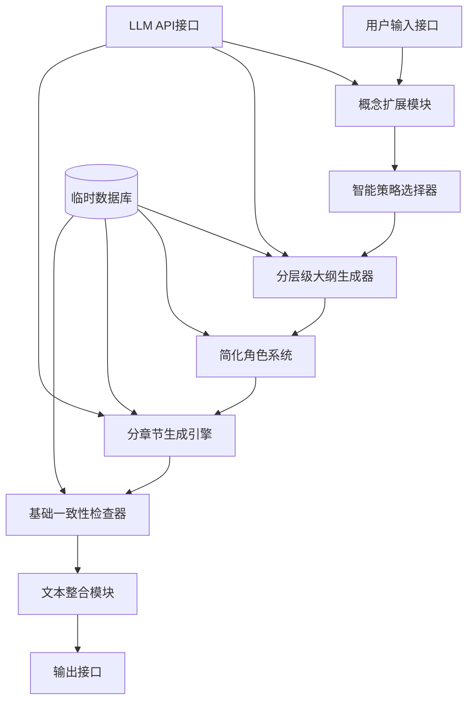

# AI智能小说生成器 - 概念验证阶段程序设计文档
**Concept Validation Phase - System Design Document**

---

## 文档信息
- **项目名称**: AI智能小说生成器概念验证版本 (AI Super Novel Generator POC)
- **文档版本**: v1.0
- **创建日期**: 2025-05-29
- **开发阶段**: 概念验证 (Proof of Concept)
- **开发周期**: 2个月
- **文档状态**: 设计中

---

## 1. 概念验证目标

### 1.1 验证目标
**核心目标**: 验证超大规模小说生成的技术可行性，为后续开发提供技术基础

**具体验证内容**:
1. **规模化生成能力**: 验证从1万字到10万字的规模化生成技术
2. **智能策略选择**: 验证根据目标字数自动选择生成策略的可行性
3. **分层级大纲系统**: 验证多层级故事结构的自动生成能力
4. **基础一致性保障**: 验证角色和世界观信息的一致性管理机制

### 1.2 技术验证指标
- **生成成功率**: ≥ 90%
- **内容连贯性**: 人工评估 ≥ 7.5/10
- **角色一致性**: 基础检测准确率 ≥ 80%
- **生成效率**: 10万字作品完成时间 ≤ 2小时

### 1.3 交付物
1. **技术可行性报告**: 详细分析超大规模生成的技术路径
2. **10万字样本小说**: 完整展示系统生成能力的示例作品
3. **核心算法验证**: 关键算法模块的功能验证和性能测试

---

## 2. 系统架构设计

### 2.1 总体架构



### 2.2 核心模块设计

#### 2.2.1 概念扩展模块 (ConceptExpander)
**功能**: 将用户一句话输入扩展为详细故事概念
```python
class ConceptExpander:
    def __init__(self, llm_client):
        self.llm_client = llm_client
        self.expansion_prompt_template = """
        基于以下用户输入，扩展为详细的故事概念：
        用户输入: {user_input}
        
        请输出JSON格式，包含：
        - theme: 核心主题
        - genre: 故事类型
        - main_conflict: 主要冲突
        - emotional_tone: 情感基调
        - protagonist_archetype: 主角原型
        - world_type: 世界类型（现实/奇幻/科幻等）
        """
    
    def expand_concept(self, user_input: str) -> dict:
        """扩展故事概念"""
        prompt = self.expansion_prompt_template.format(user_input=user_input)
        response = self.llm_client.generate(prompt)
        return self.parse_concept_json(response)
```

#### 2.2.2 智能策略选择器 (StrategySelector)
**功能**: 根据目标字数选择最优生成策略
```python
class StrategySelector:
    def __init__(self):
        self.strategy_mapping = {
            (1000, 10000): "short_story_strategy",
            (10000, 30000): "novella_strategy", 
            (30000, 100000): "novel_strategy"
        }
    
    def select_strategy(self, target_words: int, concept: dict) -> dict:
        """选择生成策略"""
        strategy_name = self._get_strategy_name(target_words)
        
        if strategy_name == "short_story_strategy":
            return {
                "structure_type": "三幕剧",
                "chapter_count": 3-5,
                "chapter_target_words": target_words // (3-5),
                "subplot_count": 0-1,
                "character_depth": "basic"
            }
        elif strategy_name == "novella_strategy":
            return {
                "structure_type": "扩展三幕剧",
                "chapter_count": 8-12,
                "chapter_target_words": target_words // (8-12),
                "subplot_count": 1-2,
                "character_depth": "medium"
            }
        elif strategy_name == "novel_strategy":
            return {
                "structure_type": "多卷本结构",
                "volume_count": 2-3,
                "chapters_per_volume": 8-15,
                "chapter_target_words": target_words // (16-45),
                "subplot_count": 3-5,
                "character_depth": "deep"
            }
```

#### 2.2.3 分层级大纲生成器 (HierarchicalOutlineGenerator)
**功能**: 生成多层级的故事大纲
```python
class HierarchicalOutlineGenerator:
    def __init__(self, llm_client):
        self.llm_client = llm_client
    
    def generate_outline(self, concept: dict, strategy: dict) -> dict:
        """生成分层级大纲"""
        if strategy["structure_type"] == "多卷本结构":
            return self._generate_multi_volume_outline(concept, strategy)
        else:
            return self._generate_standard_outline(concept, strategy)
    
    def _generate_multi_volume_outline(self, concept: dict, strategy: dict) -> dict:
        """生成多卷本大纲"""
        outline = {
            "total_target_words": strategy.get("target_words", 100000),
            "structure_type": strategy["structure_type"],
            "volumes": []
        }
        
        # 生成各卷大纲
        for volume_idx in range(strategy["volume_count"]):
            volume = self._generate_volume_outline(
                concept, volume_idx, strategy["volume_count"]
            )
            outline["volumes"].append(volume)
        
        return outline
    
    def _generate_volume_outline(self, concept: dict, volume_idx: int, total_volumes: int) -> dict:
        """生成单卷大纲"""
        volume_prompt = f"""
        基于故事概念生成第{volume_idx+1}卷的详细大纲：
        故事概念: {concept}
        当前卷: {volume_idx+1}/{total_volumes}
        
        请输出包含以下内容的JSON：
        - volume_title: 卷标题
        - volume_theme: 本卷主题
        - chapters: 章节列表，每章包含title, summary, key_events, characters_involved
        """
        
        response = self.llm_client.generate(volume_prompt)
        return self.parse_volume_json(response)
```

#### 2.2.4 简化角色系统 (SimpleCharacterSystem)
**功能**: 创建和管理主要角色信息
```python
class SimpleCharacterSystem:
    def __init__(self, llm_client):
        self.llm_client = llm_client
        self.characters_db = {}
    
    def create_characters(self, concept: dict, outline: dict) -> dict:
        """创建角色系统"""
        main_characters = self._extract_main_characters(outline)
        
        character_profiles = {}
        for char_name in main_characters:
            profile = self._generate_character_profile(char_name, concept)
            character_profiles[char_name] = profile
            self.characters_db[char_name] = profile
        
        return character_profiles
    
    def _generate_character_profile(self, char_name: str, concept: dict) -> dict:
        """生成角色档案"""
        profile_prompt = f"""
        为角色"{char_name}"创建详细档案：
        故事背景: {concept}
        
        请输出JSON格式的角色档案：
        - name: 角色名称
        - age: 年龄
        - appearance: 外貌描述
        - personality: 性格特点
        - background: 背景故事
        - motivation: 核心动机
        - skills: 特殊技能
        - relationships: 与其他角色的关系
        """
        
        response = self.llm_client.generate(profile_prompt)
        return self.parse_character_json(response)
```

#### 2.2.5 分章节生成引擎 (ChapterGenerationEngine)
**功能**: 基于大纲逐章生成文本内容
```python
class ChapterGenerationEngine:
    def __init__(self, llm_client):
        self.llm_client = llm_client
        self.generation_history = []
    
    def generate_chapter(self, chapter_outline: dict, characters: dict, 
                        previous_chapters_summary: str = "") -> str:
        """生成单章内容"""
        
        # 构建上下文
        context = self._build_context(
            chapter_outline, characters, previous_chapters_summary
        )
        
        # 生成提示词
        generation_prompt = self._build_generation_prompt(
            chapter_outline, context
        )
        
        # 调用LLM生成
        chapter_content = self.llm_client.generate(generation_prompt)
        
        # 更新历史记录
        self.generation_history.append({
            "chapter_title": chapter_outline["title"],
            "summary": chapter_outline["summary"],
            "content": chapter_content
        })
        
        return chapter_content
    
    def _build_generation_prompt(self, chapter_outline: dict, context: dict) -> str:
        """构建生成提示词"""
        return f"""
        基于以下信息写一章小说：
        
        章节大纲：
        标题: {chapter_outline["title"]}
        摘要: {chapter_outline["summary"]}
        关键事件: {chapter_outline.get("key_events", [])}
        
        角色信息：
        {context["active_characters"]}
        
        前文摘要：
        {context["previous_summary"]}
        
        写作要求：
        1. 目标字数: {chapter_outline.get("target_words", 3000)}字
        2. 包含对话、动作和描述
        3. 保持与前文的连贯性
        4. 章节结尾要有适当的钩子
        """
```

#### 2.2.6 基础一致性检查器 (BasicConsistencyChecker)
**功能**: 检查角色和情节的基础一致性
```python
class BasicConsistencyChecker:
    def __init__(self):
        self.character_tracker = {}
        self.plot_tracker = {}
    
    def check_chapter_consistency(self, chapter_content: str, 
                                 characters: dict, chapter_info: dict) -> dict:
        """检查章节一致性"""
        issues = []
        
        # 检查角色一致性
        character_issues = self._check_character_consistency(
            chapter_content, characters
        )
        issues.extend(character_issues)
        
        # 检查情节逻辑
        plot_issues = self._check_plot_consistency(
            chapter_content, chapter_info
        )
        issues.extend(plot_issues)
        
        return {
            "has_issues": len(issues) > 0,
            "issues": issues,
            "severity": self._assess_severity(issues)
        }
    
    def _check_character_consistency(self, content: str, characters: dict) -> list:
        """检查角色一致性"""
        issues = []
        
        for char_name, char_profile in characters.items():
            if char_name in content:
                # 简单的关键词检查
                if self._contains_contradictory_info(content, char_profile):
                    issues.append({
                        "type": "character_inconsistency",
                        "character": char_name,
                        "description": f"角色{char_name}的描述可能与设定不符"
                    })
        
        return issues
```

### 2.3 数据存储设计

#### 2.3.1 临时数据库结构
```sql
-- 概念验证阶段使用SQLite
-- 项目表
CREATE TABLE poc_projects (
    id INTEGER PRIMARY KEY AUTOINCREMENT,
    user_input TEXT NOT NULL,
    concept JSON,
    strategy JSON,
    outline JSON,
    characters JSON,
    target_words INTEGER,
    status VARCHAR(50),
    created_at DATETIME DEFAULT CURRENT_TIMESTAMP
);

-- 章节表
CREATE TABLE poc_chapters (
    id INTEGER PRIMARY KEY AUTOINCREMENT,
    project_id INTEGER REFERENCES poc_projects(id),
    chapter_number INTEGER,
    title VARCHAR(200),
    outline JSON,
    content TEXT,
    word_count INTEGER,
    consistency_check JSON,
    created_at DATETIME DEFAULT CURRENT_TIMESTAMP
);

-- 生成历史表
CREATE TABLE poc_generation_logs (
    id INTEGER PRIMARY KEY AUTOINCREMENT,
    project_id INTEGER REFERENCES poc_projects(id),
    step_name VARCHAR(100),
    input_data JSON,
    output_data JSON,
    execution_time REAL,
    success BOOLEAN,
    created_at DATETIME DEFAULT CURRENT_TIMESTAMP
);
```

### 2.4 API接口设计

#### 2.4.1 核心API端点
```python
from fastapi import FastAPI, HTTPException
from pydantic import BaseModel

app = FastAPI(title="AI Novel Generator POC", version="0.1.0")

class NovelRequest(BaseModel):
    user_input: str
    target_words: int = 10000
    style_preference: str = "default"

class NovelResponse(BaseModel):
    project_id: int
    status: str
    estimated_completion_time: int

@app.post("/api/v1/generate-novel", response_model=NovelResponse)
async def generate_novel(request: NovelRequest):
    """启动小说生成任务"""
    try:
        # 创建生成任务
        project_id = novel_generator.create_project(
            user_input=request.user_input,
            target_words=request.target_words,
            style=request.style_preference
        )
        
        # 异步启动生成流程
        generation_task = await novel_generator.start_generation(project_id)
        
        return NovelResponse(
            project_id=project_id,
            status="generating",
            estimated_completion_time=calculate_eta(request.target_words)
        )
    except Exception as e:
        raise HTTPException(status_code=500, detail=str(e))

@app.get("/api/v1/projects/{project_id}/status")
async def get_project_status(project_id: int):
    """获取项目生成状态"""
    return await novel_generator.get_project_status(project_id)

@app.get("/api/v1/projects/{project_id}/content")
async def get_project_content(project_id: int):
    """获取生成的小说内容"""
    return await novel_generator.get_project_content(project_id)
```

---

## 3. 核心算法实现

### 3.1 智能上下文管理算法

```python
class ContextManager:
    def __init__(self, max_context_tokens=8000):
        self.max_context_tokens = max_context_tokens
        self.compression_ratio = 0.3  # 压缩比例
    
    def build_context(self, current_chapter_info: dict, 
                     characters: dict, previous_chapters: list) -> str:
        """构建章节生成上下文"""
        
        # 1. 获取相关角色信息
        active_characters = self._get_active_characters(
            current_chapter_info, characters
        )
        
        # 2. 生成前文摘要
        previous_summary = self._summarize_previous_chapters(
            previous_chapters
        )
        
        # 3. 组合上下文信息
        context = {
            "characters": active_characters,
            "previous_summary": previous_summary,
            "current_chapter": current_chapter_info
        }
        
        # 4. 检查并压缩上下文长度
        context_str = self._format_context(context)
        if self._count_tokens(context_str) > self.max_context_tokens:
            context_str = self._compress_context(context_str)
        
        return context_str
    
    def _summarize_previous_chapters(self, previous_chapters: list) -> str:
        """生成前文摘要"""
        if not previous_chapters:
            return "这是故事的开始。"
        
        # 简化版摘要生成
        key_events = []
        for chapter in previous_chapters[-3:]:  # 只取最近3章
            key_events.append(chapter.get("summary", ""))
        
        return " ".join(key_events)
```

### 3.2 分层级生成控制算法

```python
class HierarchicalGenerationController:
    def __init__(self, strategy_selector, outline_generator, 
                 chapter_generator, consistency_checker):
        self.strategy_selector = strategy_selector
        self.outline_generator = outline_generator
        self.chapter_generator = chapter_generator
        self.consistency_checker = consistency_checker
    
    def generate_novel(self, concept: dict, target_words: int) -> dict:
        """分层级生成完整小说"""
        
        # 第1层：策略选择
        strategy = self.strategy_selector.select_strategy(target_words, concept)
        
        # 第2层：大纲生成
        outline = self.outline_generator.generate_outline(concept, strategy)
        
        # 第3层：角色创建
        characters = self.character_system.create_characters(concept, outline)
        
        # 第4层：章节生成
        generated_chapters = []
        context_manager = ContextManager()
        
        if strategy["structure_type"] == "多卷本结构":
            for volume in outline["volumes"]:
                volume_chapters = self._generate_volume_chapters(
                    volume, characters, context_manager, generated_chapters
                )
                generated_chapters.extend(volume_chapters)
        else:
            generated_chapters = self._generate_standard_chapters(
                outline, characters, context_manager
            )
        
        # 第5层：一致性检查与修复
        final_chapters = self._perform_consistency_check(
            generated_chapters, characters
        )
        
        return {
            "concept": concept,
            "strategy": strategy,
            "outline": outline,
            "characters": characters,
            "chapters": final_chapters,
            "total_words": sum(ch["word_count"] for ch in final_chapters)
        }
    
    def _generate_volume_chapters(self, volume: dict, characters: dict, 
                                 context_manager: ContextManager, 
                                 previous_chapters: list) -> list:
        """生成单卷的所有章节"""
        volume_chapters = []
        
        for chapter_outline in volume["chapters"]:
            # 构建上下文
            context = context_manager.build_context(
                chapter_outline, characters, previous_chapters + volume_chapters
            )
            
            # 生成章节内容
            chapter_content = self.chapter_generator.generate_chapter(
                chapter_outline, characters, context
            )
            
            # 一致性检查
            consistency_result = self.consistency_checker.check_chapter_consistency(
                chapter_content, characters, chapter_outline
            )
            
            # 如果有严重一致性问题，重新生成
            if consistency_result["severity"] == "high":
                chapter_content = self._regenerate_chapter_with_fixes(
                    chapter_outline, characters, context, consistency_result
                )
            
            chapter_data = {
                "outline": chapter_outline,
                "content": chapter_content,
                "word_count": len(chapter_content),
                "consistency_check": consistency_result
            }
            
            volume_chapters.append(chapter_data)
        
        return volume_chapters
```

### 3.3 质量评估算法

```python
class QualityAssessment:
    def __init__(self):
        self.metrics = {
            "coherence": CoherenceMetric(),
            "character_consistency": CharacterConsistencyMetric(),
            "plot_logic": PlotLogicMetric(),
            "language_quality": LanguageQualityMetric()
        }
    
    def evaluate_novel(self, novel_data: dict) -> dict:
        """评估完整小说质量"""
        
        overall_scores = {}
        chapter_scores = []
        
        # 逐章评估
        for chapter in novel_data["chapters"]:
            chapter_score = self._evaluate_chapter(
                chapter, novel_data["characters"], novel_data["outline"]
            )
            chapter_scores.append(chapter_score)
        
        # 计算整体分数
        for metric_name in self.metrics.keys():
            chapter_metric_scores = [
                score[metric_name] for score in chapter_scores
            ]
            overall_scores[metric_name] = np.mean(chapter_metric_scores)
        
        # 计算综合分数
        overall_scores["overall"] = np.mean(list(overall_scores.values()))
        
        return {
            "overall_scores": overall_scores,
            "chapter_scores": chapter_scores,
            "quality_grade": self._assign_quality_grade(overall_scores["overall"]),
            "recommendations": self._generate_improvement_recommendations(overall_scores)
        }
    
    def _evaluate_chapter(self, chapter: dict, characters: dict, outline: dict) -> dict:
        """评估单章质量"""
        scores = {}
        
        for metric_name, metric in self.metrics.items():
            scores[metric_name] = metric.evaluate(
                chapter["content"], 
                characters, 
                chapter["outline"]
            )
        
        return scores
    
    def _assign_quality_grade(self, overall_score: float) -> str:
        """分配质量等级"""
        if overall_score >= 8.5:
            return "A"
        elif overall_score >= 7.0:
            return "B"
        elif overall_score >= 5.5:
            return "C"
        else:
            return "D"
```

---

## 4. 实现计划

### 4.1 开发阶段划分

#### 第1周：基础框架搭建
- **任务**: 
  - 项目结构设计
  - 基础类定义
  - LLM API集成
  - 数据库初始化
- **交付物**: 
  - 基础代码框架
  - API连接测试
  - 数据库schema

#### 第2-3周：核心算法实现
- **任务**:
  - 概念扩展模块实现
  - 策略选择器实现
  - 大纲生成器实现
  - 角色系统实现
- **交付物**:
  - 核心算法模块
  - 单元测试
  - 初步功能验证

#### 第4-5周：生成引擎开发
- **任务**:
  - 章节生成引擎实现
  - 上下文管理系统
  - 一致性检查器
  - 质量评估系统
- **交付物**:
  - 完整生成流程
  - 端到端测试
  - 性能优化

#### 第6-7周：集成测试与优化
- **任务**:
  - 系统集成测试
  - 性能优化
  - 错误处理完善
  - 用户界面开发
- **交付物**:
  - 完整POC系统
  - 测试报告
  - 演示界面

#### 第8周：验证与报告
- **任务**:
  - 生成10万字样本小说
  - 质量评估和分析
  - 技术可行性报告编写
  - 后续开发建议
- **交付物**:
  - 技术可行性报告
  - 样本小说作品
  - 开发建议文档

### 4.2 技术栈选择

#### 开发语言与框架
- **后端**: Python 3.11+
- **Web框架**: FastAPI
- **数据库**: SQLite (概念验证阶段)
- **异步处理**: asyncio + Celery
- **前端**: React + TypeScript (简化版)

#### 外部服务
- **主要LLM**: OpenAI GPT-4 Turbo
- **备用LLM**: Anthropic Claude 3 Haiku (成本优化)
- **文本处理**: spaCy + NLTK
- **向量计算**: numpy + scipy

#### 开发工具
- **代码管理**: Git + GitHub
- **依赖管理**: Poetry
- **测试框架**: pytest
- **代码质量**: black + flake8 + mypy
- **文档**: Sphinx

### 4.3 项目结构

```
ai_novel_generator_poc/
├── src/
│   ├── core/
│   │   ├── concept_expander.py
│   │   ├── strategy_selector.py
│   │   ├── outline_generator.py
│   │   ├── character_system.py
│   │   ├── chapter_generator.py
│   │   └── consistency_checker.py
│   ├── models/
│   │   ├── data_models.py
│   │   └── database.py
│   ├── api/
│   │   ├── routes.py
│   │   └── schemas.py
│   ├── utils/
│   │   ├── llm_client.py
│   │   ├── text_processor.py
│   │   └── quality_metrics.py
│   └── config/
│       ├── settings.py
│       └── prompts.py
├── tests/
│   ├── unit/
│   ├── integration/
│   └── fixtures/
├── docs/
│   ├── api_docs/
│   └── design_docs/
├── scripts/
│   ├── setup_db.py
│   └── run_tests.py
├── frontend/
│   ├── src/
│   └── public/
├── requirements.txt
├── pyproject.toml
└── README.md
```

---

## 5. 测试策略

### 5.1 单元测试
```python
# 示例：概念扩展模块测试
import pytest
from src.core.concept_expander import ConceptExpander

class TestConceptExpander:
    @pytest.fixture
    def concept_expander(self, mock_llm_client):
        return ConceptExpander(mock_llm_client)
    
    def test_expand_simple_concept(self, concept_expander):
        """测试简单概念扩展"""
        user_input = "一个孤儿发现自己是魔法世界的救世主"
        result = concept_expander.expand_concept(user_input)
        
        assert "theme" in result
        assert "genre" in result
        assert "main_conflict" in result
        assert result["genre"] in ["奇幻", "魔幻", "冒险"]
    
    def test_expand_scifi_concept(self, concept_expander):
        """测试科幻概念扩展"""
        user_input = "在火星殖民地，一名侦探调查连环谋杀案"
        result = concept_expander.expand_concept(user_input)
        
        assert result["world_type"] == "科幻"
        assert "侦探" in result["main_conflict"] or "调查" in result["main_conflict"]
```

### 5.2 集成测试
```python
class TestNovelGenerationFlow:
    def test_complete_short_story_generation(self):
        """测试完整短篇小说生成流程"""
        user_input = "一个机器人获得了情感"
        target_words = 5000
        
        # 启动生成流程
        result = novel_generator.generate_novel(user_input, target_words)
        
        # 验证结果
        assert result["total_words"] >= target_words * 0.8
        assert result["total_words"] <= target_words * 1.2
        assert len(result["chapters"]) >= 3
        assert all(ch["consistency_check"]["has_issues"] == False 
                  for ch in result["chapters"])
    
    def test_novel_generation_10k_words(self):
        """测试10万字小说生成"""
        user_input = "在一个蒸汽朋克世界里，一名发明家试图拯救被污染的城市"
        target_words = 100000
        
        result = novel_generator.generate_novel(user_input, target_words)
        
        # 验证规模
        assert result["total_words"] >= 90000
        assert result["total_words"] <= 110000
        
        # 验证结构
        assert result["strategy"]["structure_type"] == "多卷本结构"
        assert len(result["outline"]["volumes"]) >= 2
        
        # 验证质量
        quality_score = quality_assessor.evaluate_novel(result)
        assert quality_score["overall_scores"]["overall"] >= 6.0
```

### 5.3 性能测试
```python
class TestPerformance:
    def test_generation_speed(self):
        """测试生成速度"""
        start_time = time.time()
        
        result = novel_generator.generate_novel("科幻冒险故事", 10000)
        
        end_time = time.time()
        generation_time = end_time - start_time
        
        # 验证时间要求
        assert generation_time <= 3600  # 1小时内完成1万字生成
        
        words_per_minute = result["total_words"] / (generation_time / 60)
        assert words_per_minute >= 200  # 至少每分钟200字
    
    def test_memory_usage(self):
        """测试内存使用"""
        import psutil
        import os
        
        process = psutil.Process(os.getpid())
        initial_memory = process.memory_info().rss
        
        # 生成大型小说
        result = novel_generator.generate_novel("史诗奇幻故事", 100000)
        
        peak_memory = process.memory_info().rss
        memory_increase = peak_memory - initial_memory
        
        # 验证内存使用合理（小于2GB）
        assert memory_increase < 2 * 1024 * 1024 * 1024
```

---

## 6. 风险分析与应对

### 6.1 技术风险

#### 6.1.1 LLM API限制风险
**风险描述**: API调用频率限制、成本过高、服务不稳定
**应对措施**:
- 实现API调用缓存机制
- 设计降级策略（备用模型）
- 实现请求重试和错误处理
- 建立成本监控和预警系统

```python
class LLMClientWithFallback:
    def __init__(self):
        self.primary_client = OpenAIClient()
        self.fallback_client = ClaudeClient()
        self.cache = RequestCache()
    
    def generate(self, prompt: str, **kwargs) -> str:
        # 检查缓存
        cached_result = self.cache.get(prompt)
        if cached_result:
            return cached_result
        
        try:
            result = self.primary_client.generate(prompt, **kwargs)
        except (RateLimitError, APIError) as e:
            logger.warning(f"Primary API failed: {e}, using fallback")
            result = self.fallback_client.generate(prompt, **kwargs)
        
        # 缓存结果
        self.cache.set(prompt, result)
        return result
```

#### 6.1.2 内容质量不稳定风险
**风险描述**: 生成内容质量波动大，一致性差
**应对措施**:
- 实现多轮验证机制
- 建立质量阈值检查
- 设计自动重生成流程
- 增加人工审核节点

#### 6.1.3 性能瓶颈风险
**风险描述**: 大规模生成时性能不足，响应时间过长
**应对措施**:
- 实现异步处理机制
- 设计分块生成策略
- 建立进度反馈系统
- 优化数据库查询

### 6.2 业务风险

#### 6.2.1 用户期望管理风险
**风险描述**: 用户对AI生成质量期望过高
**应对措施**:
- 明确标注为概念验证版本
- 提供详细的功能说明
- 设置合理的质量预期
- 收集用户反馈并快速迭代

#### 6.2.2 内容版权风险
**风险描述**: 生成内容可能涉及版权问题
**应对措施**:
- 实现内容原创性检测
- 添加版权免责声明
- 建立内容审核机制
- 提供内容修改建议

---

## 7. 成功标准与验收条件

### 7.1 功能验收标准

#### 基础功能验收
- [x] 用户输入一句话，系统能够扩展为详细故事概念
- [x] 系统能够根据目标字数自动选择生成策略
- [x] 能够生成结构化的多层级故事大纲
- [x] 能够创建基本的角色档案系统
- [x] 能够基于大纲逐章生成文本内容
- [x] 具备基础的一致性检查能力

#### 规模化功能验收
- [x] 支持1000-100,000字范围的小说生成
- [x] 10万字作品能够在2小时内完成生成
- [x] 生成内容具备基本的故事结构和逻辑
- [x] 角色信息在全文中保持基本一致

### 7.2 质量验收标准

#### 内容质量标准
- **连贯性**: 人工评估平均分≥7.5/10
- **原创性**: 与现有作品重复度<10%
- **完整性**: 具备完整的开头、发展、高潮、结尾
- **可读性**: 语言表达流畅，逻辑清晰

#### 技术质量标准
- **成功率**: 生成成功率≥90%
- **稳定性**: 连续运行24小时无崩溃
- **响应时间**: API响应时间<5秒
- **资源使用**: 内存使用<2GB

### 7.3 交付验收清单

#### 代码交付
- [ ] 完整的POC系统代码
- [ ] 单元测试覆盖率≥80%
- [ ] 集成测试覆盖主要流程
- [ ] 代码文档和注释完整
- [ ] 部署文档和说明

#### 功能演示
- [ ] 10万字完整小说样本
- [ ] 多种题材的生成示例
- [ ] 质量评估报告
- [ ] 性能测试报告
- [ ] 用户操作演示视频

#### 技术文档
- [ ] 技术可行性分析报告
- [ ] 核心算法说明文档
- [ ] API接口文档
- [ ] 数据库设计文档
- [ ] 后续开发建议

---

## 8. 后续发展建议

### 8.1 MVP版本开发方向

基于概念验证的结果，MVP版本应重点关注：

1. **扩展规模能力**: 支持50万字规模生成
2. **增强一致性管理**: 实现向量数据库存储和检索
3. **优化生成质量**: 引入多轮修订机制
4. **完善用户体验**: 开发完整的Web界面

### 8.2 技术架构演进

1. **数据库升级**: 从SQLite迁移到PostgreSQL
2. **缓存系统**: 引入Redis缓存层
3. **消息队列**: 使用Celery处理长时间任务
4. **监控系统**: 集成Prometheus和Grafana

### 8.3 算法优化方向

1. **上下文管理**: 实现更智能的压缩算法
2. **质量控制**: 引入多维度质量评估模型
3. **个性化**: 支持用户风格偏好学习
4. **效率优化**: 实现并行生成和缓存机制

---

## 结语

本概念验证阶段的程序设计文档为AI智能小说生成器项目奠定了技术基础。通过2个月的开发周期，我们将验证超大规模小说生成的核心技术可行性，为后续的MVP和正式版本开发提供重要的技术依据和实践经验。

项目的成功将证明基于大语言模型的智能创作系统在文学创作领域的巨大潜力，为推进AI辅助创作技术的发展做出重要贡献。

---

**文档版本**: v1.0  
**最后更新**: 2025-05-29  
**下次评审**: 2025-06-15