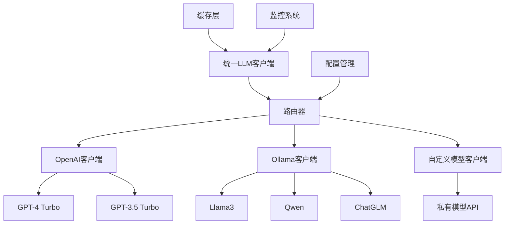

# 多LLM提供商架构设计
**Multi-LLM Provider Architecture Design**

---

## 文档信息
- **项目名称**: AI智能小说生成器 - 多LLM提供商支持
- **文档版本**: v1.0
- **创建日期**: 2025-05-29
- **关联文档**: Project_Development_Plan.md

---

## 1. 架构概览

### 1.1 设计目标
- **多样性**: 支持OpenAI、Ollama、自定义模型等多种LLM提供商
- **可靠性**: 实现智能路由和自动降级机制
- **成本控制**: 根据成本和性能自动选择最优提供商
- **扩展性**: 易于添加新的LLM提供商

### 1.2 核心组件


---

## 2. 统一LLM客户端设计

### 2.1 UniversalLLMClient类
```python
from abc import ABC, abstractmethod
from typing import Dict, Any, Optional, List
import logging
from dataclasses import dataclass
from enum import Enum

class ProviderType(Enum):
    OPENAI = "openai"
    OLLAMA = "ollama"
    CUSTOM = "custom"
    ANTHROPIC = "anthropic"

@dataclass
class LLMRequest:
    prompt: str
    max_tokens: int = 4096
    temperature: float = 0.7
    model: Optional[str] = None
    provider: Optional[ProviderType] = None
    system_prompt: Optional[str] = None

@dataclass
class LLMResponse:
    content: str
    provider: ProviderType
    model: str
    tokens_used: int
    cost: float
    response_time: float

class BaseLLMProvider(ABC):
    """LLM提供商基础抽象类"""
    
    @abstractmethod
    def generate(self, request: LLMRequest) -> LLMResponse:
        """生成文本内容"""
        pass
    
    @abstractmethod
    def is_available(self) -> bool:
        """检查提供商是否可用"""
        pass
    
    @abstractmethod
    def get_models(self) -> List[str]:
        """获取支持的模型列表"""
        pass

class UniversalLLMClient:
    def __init__(self, config: Dict[str, Any]):
        self.config = config
        self.providers: Dict[ProviderType, BaseLLMProvider] = {}
        self.router = LLMRouter(config)
        self.cache = LLMCache()
        self.monitor = LLMMonitor()
        
        self._initialize_providers()
    
    def _initialize_providers(self):
        """初始化所有LLM提供商"""
        if self.config.get('openai', {}).get('enabled', False):
            self.providers[ProviderType.OPENAI] = OpenAIProvider(
                self.config['openai']
            )
        
        if self.config.get('ollama', {}).get('enabled', False):
            self.providers[ProviderType.OLLAMA] = OllamaProvider(
                self.config['ollama']
            )
        
        if self.config.get('custom', {}).get('enabled', False):
            self.providers[ProviderType.CUSTOM] = CustomModelProvider(
                self.config['custom']
            )
    
    async def generate(self, request: LLMRequest) -> LLMResponse:
        """统一生成接口"""
        # 1. 检查缓存
        cache_key = self._generate_cache_key(request)
        cached_response = await self.cache.get(cache_key)
        if cached_response:
            return cached_response
        
        # 2. 路由选择提供商
        if not request.provider:
            request.provider = await self.router.select_provider(request)
        
        # 3. 生成内容
        response = await self._generate_with_fallback(request)
        
        # 4. 缓存结果
        await self.cache.set(cache_key, response)
        
        # 5. 记录监控数据
        self.monitor.record_request(request, response)
        
        return response
    
    async def _generate_with_fallback(self, request: LLMRequest) -> LLMResponse:
        """带降级的生成方法"""
        provider_sequence = self.router.get_provider_sequence(request.provider)
        
        for provider_type in provider_sequence:
            if provider_type not in self.providers:
                continue
                
            provider = self.providers[provider_type]
            
            if not await provider.is_available():
                logging.warning(f"Provider {provider_type} is not available")
                continue
            
            try:
                # 调整请求以适配当前提供商
                adapted_request = self._adapt_request_for_provider(
                    request, provider_type
                )
                
                response = await provider.generate(adapted_request)
                return response
                
            except Exception as e:
                logging.error(f"Provider {provider_type} failed: {e}")
                continue
        
        raise Exception("All LLM providers failed")
```

### 2.2 智能路由器
```python
class LLMRouter:
    def __init__(self, config: Dict[str, Any]):
        self.config = config
        self.cost_weights = config.get('cost_weights', {})
        self.performance_weights = config.get('performance_weights', {})
        
    async def select_provider(self, request: LLMRequest) -> ProviderType:
        """智能选择LLM提供商"""
        
        # 根据请求特征选择提供商
        if self._is_simple_task(request):
            # 简单任务优先使用本地模型
            if self._is_provider_available(ProviderType.OLLAMA):
                return ProviderType.OLLAMA
        
        if self._is_complex_task(request):
            # 复杂任务优先使用高性能模型
            if self._is_provider_available(ProviderType.OPENAI):
                return ProviderType.OPENAI
        
        # 默认成本优先策略
        return self._select_by_cost()
    
    def _is_simple_task(self, request: LLMRequest) -> bool:
        """判断是否为简单任务"""
        return (
            len(request.prompt) < 1000 and
            request.max_tokens < 2000
        )
    
    def _is_complex_task(self, request: LLMRequest) -> bool:
        """判断是否为复杂任务"""
        return (
            len(request.prompt) > 5000 or
            request.max_tokens > 3000 or
            "创意" in request.prompt or
            "创作" in request.prompt
        )
    
    def _select_by_cost(self) -> ProviderType:
        """基于成本选择提供商"""
        available_providers = [
            provider for provider in ProviderType 
            if self._is_provider_available(provider)
        ]
        
        if not available_providers:
            raise Exception("No available providers")
        
        # 按成本排序，优先选择低成本提供商
        sorted_providers = sorted(
            available_providers,
            key=lambda p: self.cost_weights.get(p.value, 0)
        )
        
        return sorted_providers[0]
    
    def get_provider_sequence(self, primary_provider: ProviderType) -> List[ProviderType]:
        """获取提供商降级序列"""
        fallback_map = {
            ProviderType.OPENAI: [ProviderType.OPENAI, ProviderType.OLLAMA, ProviderType.CUSTOM],
            ProviderType.OLLAMA: [ProviderType.OLLAMA, ProviderType.OPENAI, ProviderType.CUSTOM],
            ProviderType.CUSTOM: [ProviderType.CUSTOM, ProviderType.OLLAMA, ProviderType.OPENAI]
        }
        
        return fallback_map.get(primary_provider, [primary_provider])
```

---

## 3. Ollama提供商实现

### 3.1 OllamaProvider类
```python
import httpx
import asyncio
from typing import List

class OllamaProvider(BaseLLMProvider):
    def __init__(self, config: Dict[str, Any]):
        self.base_url = config.get('base_url', 'http://localhost:11434')
        self.timeout = config.get('timeout', 300)
        self.available_models = config.get('models', [])
        self.default_model = config.get('default_model', 'llama3:8b')
        
    async def generate(self, request: LLMRequest) -> LLMResponse:
        """通过Ollama API生成内容"""
        import time
        start_time = time.time()
        
        model = request.model or self.default_model
        
        payload = {
            "model": model,
            "prompt": self._build_prompt(request),
            "stream": False,
            "options": {
                "temperature": request.temperature,
                "num_predict": request.max_tokens
            }
        }
        
        async with httpx.AsyncClient(timeout=self.timeout) as client:
            response = await client.post(
                f"{self.base_url}/api/generate",
                json=payload
            )
            response.raise_for_status()
            
        result = response.json()
        content = result.get('response', '')
        
        response_time = time.time() - start_time
        tokens_used = self._count_tokens(content)
        
        return LLMResponse(
            content=content,
            provider=ProviderType.OLLAMA,
            model=model,
            tokens_used=tokens_used,
            cost=0.0,  # Ollama本地免费
            response_time=response_time
        )
    
    async def is_available(self) -> bool:
        """检查Ollama服务是否可用"""
        try:
            async with httpx.AsyncClient(timeout=10) as client:
                response = await client.get(f"{self.base_url}/api/tags")
                return response.status_code == 200
        except Exception:
            return False
    
    async def get_models(self) -> List[str]:
        """获取Ollama可用模型列表"""
        try:
            async with httpx.AsyncClient(timeout=10) as client:
                response = await client.get(f"{self.base_url}/api/tags")
                if response.status_code == 200:
                    data = response.json()
                    return [model['name'] for model in data.get('models', [])]
        except Exception:
            pass
        return self.available_models
    
    def _build_prompt(self, request: LLMRequest) -> str:
        """构建Ollama格式的提示词"""
        if request.system_prompt:
            return f"System: {request.system_prompt}\n\nUser: {request.prompt}\n\nAssistant:"
        return request.prompt
    
    def _count_tokens(self, text: str) -> int:
        """简单的token计数（可以使用更精确的方法）"""
        return len(text.split())
    
    async def download_model(self, model_name: str) -> bool:
        """下载指定的模型"""
        try:
            payload = {"name": model_name}
            async with httpx.AsyncClient(timeout=3600) as client:
                response = await client.post(
                    f"{self.base_url}/api/pull",
                    json=payload
                )
                return response.status_code == 200
        except Exception as e:
            logging.error(f"Failed to download model {model_name}: {e}")
            return False
```

### 3.2 Ollama服务管理
```python
class OllamaServiceManager:
    def __init__(self, config: Dict[str, Any]):
        self.config = config
        self.required_models = config.get('required_models', ['llama3:8b'])
        
    async def setup_ollama_service(self):
        """设置Ollama服务"""
        # 1. 检查Ollama是否安装
        if not await self._is_ollama_installed():
            raise Exception("Ollama is not installed")
        
        # 2. 启动Ollama服务
        await self._start_ollama_service()
        
        # 3. 下载必需的模型
        await self._download_required_models()
    
    async def _is_ollama_installed(self) -> bool:
        """检查Ollama是否已安装"""
        try:
            process = await asyncio.create_subprocess_exec(
                'ollama', '--version',
                stdout=asyncio.subprocess.PIPE,
                stderr=asyncio.subprocess.PIPE
            )
            await process.communicate()
            return process.returncode == 0
        except FileNotFoundError:
            return False
    
    async def _start_ollama_service(self):
        """启动Ollama服务"""
        try:
            # 检查服务是否已运行
            provider = OllamaProvider(self.config)
            if await provider.is_available():
                return
            
            # 启动服务
            process = await asyncio.create_subprocess_exec(
                'ollama', 'serve',
                stdout=asyncio.subprocess.PIPE,
                stderr=asyncio.subprocess.PIPE
            )
            
            # 等待服务启动
            await asyncio.sleep(5)
            
            if not await provider.is_available():
                raise Exception("Failed to start Ollama service")
                
        except Exception as e:
            logging.error(f"Failed to start Ollama service: {e}")
            raise
    
    async def _download_required_models(self):
        """下载必需的模型"""
        provider = OllamaProvider(self.config)
        
        for model in self.required_models:
            available_models = await provider.get_models()
            if model not in available_models:
                logging.info(f"Downloading model: {model}")
                success = await provider.download_model(model)
                if not success:
                    logging.warning(f"Failed to download model: {model}")
```

---

## 4. 自定义模型提供商

### 4.1 CustomModelProvider类
```python
class CustomModelProvider(BaseLLMProvider):
    def __init__(self, config: Dict[str, Any]):
        self.base_url = config['base_url']
        self.api_key = config.get('api_key')
        self.timeout = config.get('timeout', 120)
        self.models = config.get('models', [])
        self.headers = self._build_headers()
        
    def _build_headers(self) -> Dict[str, str]:
        """构建请求头"""
        headers = {'Content-Type': 'application/json'}
        if self.api_key:
            headers['Authorization'] = f'Bearer {self.api_key}'
        return headers
    
    async def generate(self, request: LLMRequest) -> LLMResponse:
        """通过自定义API生成内容"""
        import time
        start_time = time.time()
        
        payload = self._build_payload(request)
        
        async with httpx.AsyncClient(timeout=self.timeout) as client:
            response = await client.post(
                f"{self.base_url}/generate",
                json=payload,
                headers=self.headers
            )
            response.raise_for_status()
            
        result = response.json()
        content = self._extract_content(result)
        
        response_time = time.time() - start_time
        tokens_used = self._count_tokens(content)
        cost = self._calculate_cost(tokens_used)
        
        return LLMResponse(
            content=content,
            provider=ProviderType.CUSTOM,
            model=request.model or self.models[0],
            tokens_used=tokens_used,
            cost=cost,
            response_time=response_time
        )
    
    def _build_payload(self, request: LLMRequest) -> Dict[str, Any]:
        """构建API请求载荷"""
        # 这里需要根据实际的自定义API格式调整
        return {
            "model": request.model or self.models[0],
            "prompt": request.prompt,
            "max_tokens": request.max_tokens,
            "temperature": request.temperature,
            "system_prompt": request.system_prompt
        }
    
    def _extract_content(self, response_data: Dict[str, Any]) -> str:
        """从响应中提取内容"""
        # 根据实际API响应格式调整
        return response_data.get('content', '') or response_data.get('text', '')
    
    async def is_available(self) -> bool:
        """检查自定义API是否可用"""
        try:
            async with httpx.AsyncClient(timeout=10) as client:
                response = await client.get(
                    f"{self.base_url}/health",
                    headers=self.headers
                )
                return response.status_code == 200
        except Exception:
            return False
    
    async def get_models(self) -> List[str]:
        """获取可用模型列表"""
        return self.models
    
    def _count_tokens(self, text: str) -> int:
        """token计数"""
        return len(text.split())
    
    def _calculate_cost(self, tokens: int) -> float:
        """计算成本"""
        cost_per_1k = self.config.get('cost_per_1k_tokens', 0.005)
        return (tokens / 1000) * cost_per_1k
```

---

## 5. 缓存和监控系统

### 5.1 LLM缓存
```python
import hashlib
import json
from typing import Optional
import aioredis

class LLMCache:
    def __init__(self, redis_url: str = "redis://localhost:6379"):
        self.redis_url = redis_url
        self.redis = None
        self.ttl = 3600  # 1小时缓存
        
    async def connect(self):
        """连接Redis"""
        self.redis = await aioredis.from_url(self.redis_url)
    
    async def get(self, cache_key: str) -> Optional[LLMResponse]:
        """获取缓存的响应"""
        if not self.redis:
            await self.connect()
            
        cached_data = await self.redis.get(cache_key)
        if cached_data:
            data = json.loads(cached_data)
            return LLMResponse(**data)
        return None
    
    async def set(self, cache_key: str, response: LLMResponse):
        """设置缓存"""
        if not self.redis:
            await self.connect()
            
        cache_data = {
            'content': response.content,
            'provider': response.provider.value,
            'model': response.model,
            'tokens_used': response.tokens_used,
            'cost': response.cost,
            'response_time': response.response_time
        }
        
        await self.redis.setex(
            cache_key, 
            self.ttl, 
            json.dumps(cache_data)
        )
    
    def generate_cache_key(self, request: LLMRequest) -> str:
        """生成缓存键"""
        cache_content = {
            'prompt': request.prompt,
            'max_tokens': request.max_tokens,
            'temperature': request.temperature,
            'system_prompt': request.system_prompt
        }
        content_str = json.dumps(cache_content, sort_keys=True)
        return hashlib.md5(content_str.encode()).hexdigest()
```

### 5.2 监控系统
```python
from prometheus_client import Counter, Histogram, Gauge
import time

class LLMMonitor:
    def __init__(self):
        self.request_counter = Counter(
            'llm_requests_total', 
            'Total LLM requests',
            ['provider', 'model', 'status']
        )
        
        self.response_time_histogram = Histogram(
            'llm_response_time_seconds',
            'LLM response time',
            ['provider', 'model']
        )
        
        self.token_usage_counter = Counter(
            'llm_tokens_used_total',
            'Total tokens used',
            ['provider', 'model']
        )
        
        self.cost_counter = Counter(
            'llm_cost_total',
            'Total cost in USD',
            ['provider', 'model']
        )
        
        self.active_providers = Gauge(
            'llm_active_providers',
            'Number of active LLM providers'
        )
    
    def record_request(self, request: LLMRequest, response: LLMResponse):
        """记录请求指标"""
        provider = response.provider.value
        model = response.model
        
        # 记录请求计数
        self.request_counter.labels(
            provider=provider, 
            model=model, 
            status='success'
        ).inc()
        
        # 记录响应时间
        self.response_time_histogram.labels(
            provider=provider, 
            model=model
        ).observe(response.response_time)
        
        # 记录token使用量
        self.token_usage_counter.labels(
            provider=provider, 
            model=model
        ).inc(response.tokens_used)
        
        # 记录成本
        self.cost_counter.labels(
            provider=provider, 
            model=model
        ).inc(response.cost)
    
    def record_error(self, request: LLMRequest, provider: ProviderType, error: Exception):
        """记录错误"""
        self.request_counter.labels(
            provider=provider.value,
            model=request.model or 'unknown',
            status='error'
        ).inc()
    
    def update_active_providers(self, count: int):
        """更新活跃提供商数量"""
        self.active_providers.set(count)
```

---

## 6. 配置管理

### 6.1 配置文件示例
```yaml
# config/llm_providers.yaml
llm_providers:
  openai:
    enabled: true
    api_key: "${OPENAI_API_KEY}"
    models:
      - "gpt-4-turbo"
      - "gpt-3.5-turbo"
    default_model: "gpt-4-turbo"
    max_tokens: 4096
    cost_per_1k_tokens: 0.01
    timeout: 60
    
  ollama:
    enabled: true
    base_url: "http://localhost:11434"
    models:
      - "llama3:8b"
      - "qwen:7b"
      - "chatglm3:6b"
    default_model: "llama3:8b"
    timeout: 300
    cost_per_1k_tokens: 0.0
    required_models:
      - "llama3:8b"
    auto_download: true
    
  custom:
    enabled: false
    base_url: "https://your-custom-api.com"
    api_key: "${CUSTOM_API_KEY}"
    models:
      - "your-model-v1"
    default_model: "your-model-v1"
    timeout: 120
    cost_per_1k_tokens: 0.005

routing:
  strategy: "cost_optimized"  # cost_optimized, performance_first, local_first
  cost_weights:
    openai: 1.0
    ollama: 0.0
    custom: 0.5
  performance_weights:
    openai: 1.0
    ollama: 0.7
    custom: 0.8

caching:
  enabled: true
  redis_url: "redis://localhost:6379"
  ttl: 3600

monitoring:
  enabled: true
  prometheus_port: 8000
```

---

## 7. 测试策略

### 7.1 单元测试
```python
import pytest
from unittest.mock import AsyncMock, patch

class TestUniversalLLMClient:
    @pytest.fixture
    async def llm_client(self):
        config = {
            'openai': {'enabled': True, 'api_key': 'test-key'},
            'ollama': {'enabled': True, 'base_url': 'http://localhost:11434'},
            'custom': {'enabled': False}
        }
        client = UniversalLLMClient(config)
        await client.initialize()
        return client
    
    @pytest.mark.asyncio
    async def test_provider_selection(self, llm_client):
        """测试提供商选择逻辑"""
        # 简单任务应该选择Ollama
        simple_request = LLMRequest(
            prompt="Hello", 
            max_tokens=100
        )
        provider = await llm_client.router.select_provider(simple_request)
        assert provider == ProviderType.OLLAMA
        
        # 复杂任务应该选择OpenAI
        complex_request = LLMRequest(
            prompt="写一篇关于人工智能的深度分析文章" * 100,
            max_tokens=4000
        )
        provider = await llm_client.router.select_provider(complex_request)
        assert provider == ProviderType.OPENAI
    
    @pytest.mark.asyncio
    async def test_fallback_mechanism(self, llm_client):
        """测试降级机制"""
        request = LLMRequest(prompt="Test prompt")
        
        # 模拟主提供商失败
        with patch.object(llm_client.providers[ProviderType.OPENAI], 'generate') as mock_openai:
            mock_openai.side_effect = Exception("API Error")
            
            with patch.object(llm_client.providers[ProviderType.OLLAMA], 'generate') as mock_ollama:
                mock_ollama.return_value = LLMResponse(
                    content="Generated content",
                    provider=ProviderType.OLLAMA,
                    model="llama3:8b",
                    tokens_used=10,
                    cost=0.0,
                    response_time=1.0
                )
                
                response = await llm_client.generate(request)
                assert response.provider == ProviderType.OLLAMA
                assert response.content == "Generated content"

class TestOllamaProvider:
    @pytest.mark.asyncio
    async def test_ollama_availability(self):
        """测试Ollama可用性检查"""
        config = {'base_url': 'http://localhost:11434'}
        provider = OllamaProvider(config)
        
        with patch('httpx.AsyncClient.get') as mock_get:
            mock_get.return_value.status_code = 200
            is_available = await provider.is_available()
            assert is_available
    
    @pytest.mark.asyncio
    async def test_model_download(self):
        """测试模型下载"""
        config = {'base_url': 'http://localhost:11434'}
        provider = OllamaProvider(config)
        
        with patch('httpx.AsyncClient.post') as mock_post:
            mock_post.return_value.status_code = 200
            success = await provider.download_model("llama3:8b")
            assert success
```

### 7.2 集成测试
```python
class TestLLMIntegration:
    @pytest.mark.integration
    @pytest.mark.asyncio
    async def test_full_generation_flow(self):
        """测试完整的生成流程"""
        config = load_test_config()
        client = UniversalLLMClient(config)
        
        request = LLMRequest(
            prompt="写一个关于友谊的短故事",
            max_tokens=1000,
            temperature=0.7
        )
        
        response = await client.generate(request)
        
        assert isinstance(response.content, str)
        assert len(response.content) > 0
        assert response.tokens_used > 0
        assert response.response_time > 0
    
    @pytest.mark.integration
    @pytest.mark.asyncio
    async def test_concurrent_requests(self):
        """测试并发请求处理"""
        config = load_test_config()
        client = UniversalLLMClient(config)
        
        requests = [
            LLMRequest(prompt=f"故事{i}", max_tokens=500)
            for i in range(5)
        ]
        
        responses = await asyncio.gather(*[
            client.generate(req) for req in requests
        ])
        
        assert len(responses) == 5
        assert all(isinstance(resp.content, str) for resp in responses)
```

---

## 8. 部署指南

### 8.1 Docker Compose配置
```yaml
# docker-compose.yml
version: '3.8'

services:
  app:
    build: .
    ports:
      - "8000:8000"
    environment:
      - OPENAI_API_KEY=${OPENAI_API_KEY}
      - CUSTOM_API_KEY=${CUSTOM_API_KEY}
    depends_on:
      - redis
      - ollama
    volumes:
      - ./config:/app/config

  ollama:
    image: ollama/ollama:latest
    ports:
      - "11434:11434"
    volumes:
      - ollama_data:/root/.ollama
    environment:
      - OLLAMA_HOST=0.0.0.0

  redis:
    image: redis:7-alpine
    ports:
      - "6379:6379"
    volumes:
      - redis_data:/data

  prometheus:
    image: prom/prometheus:latest
    ports:
      - "9090:9090"
    volumes:
      - ./monitoring/prometheus.yml:/etc/prometheus/prometheus.yml

volumes:
  ollama_data:
  redis_data:
```

### 8.2 初始化脚本
```bash
#!/bin/bash
# scripts/setup_llm_providers.sh

echo "Setting up LLM providers..."

# 1. 启动服务
docker-compose up -d

# 2. 等待Ollama启动
echo "Waiting for Ollama to start..."
sleep 10

# 3. 下载必需的模型
echo "Downloading required models..."
docker-compose exec ollama ollama pull llama3:8b
docker-compose exec ollama ollama pull qwen:7b

# 4. 测试所有提供商
echo "Testing providers..."
python scripts/test_providers.py

echo "Setup complete!"
```

---

## 结语

多LLM提供商架构为AI小说生成器提供了强大的灵活性和可靠性保障。通过支持OpenAI、Ollama和自定义模型，系统可以：

1. **降低成本**: 优先使用免费的本地Ollama模型
2. **提高可靠性**: 多提供商降级机制确保服务持续可用
3. **优化性能**: 根据任务复杂度智能选择最适合的模型
4. **增强隐私**: 支持本地部署的模型，保护数据隐私

这个架构为项目的长期发展和商业化部署奠定了坚实基础。